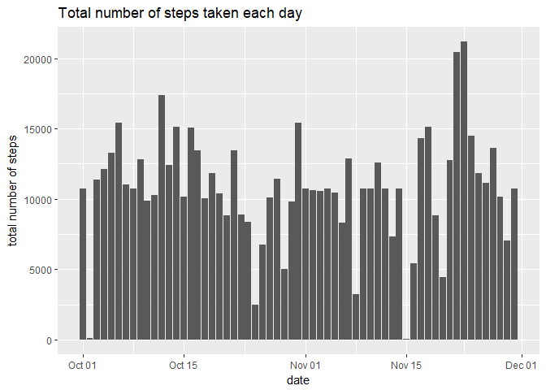

  
  
## Loading and preprocessing the data

```r
input <- read.csv("activity.csv")
input$date <- as.Date(as.character(input$date), "%Y-%m-%d")
```
  
  
## What is mean total number of steps taken per day?

```r
stepsum <- with(input, aggregate(steps,list(date),sum,na.rm=T))
names(stepsum)<- c("date", "steps")
meanstep <- mean(stepsum$steps)
medianstep <- median(stepsum$steps)
library(ggplot2)
```

```
## Warning: package 'ggplot2' was built under R version 3.4.3
```

```r
ggplot(stepsum, aes(date, steps)) + geom_col() + ggtitle("Total number of steps taken each day") + ylab("total number of steps")
```

<!-- -->
  
Mean number of steps take per each day = 9354.2295082  
Median number of steps take per each day= 10395        
  
    
## What is the average daily activity pattern?

```r
intervalstep <- with(input, aggregate(steps,list(interval),mean,na.rm=T))
names(intervalstep) <- c("interval", "avgsteps")
maxinterval <- intervalstep[which.max(intervalstep$avgsteps),]$interval
with(intervalstep, plot(interval, avgsteps, type = "l", main = "Average number of steps taken per day"), ylab = "average number of steps")
```

<!-- -->
  
The 5-minute interval which contains the maximum number of steps = 835      
  
  
## Imputing missing values
Filling in missing values of steps with mean number of steps of the 5-minute interval.

```r
numNA <- nrow(input[is.na(input$steps),])
```
Number of missing values = 2304  
  

```r
inputdata <- merge(input,intervalstep,by.x = "interval", by.y="interval")
inputdata$steps[is.na(inputdata$steps)]<- inputdata$avgsteps[is.na(inputdata$steps)]
inputdata$avgsteps<-NULL
stepsum2 <- with(inputdata, aggregate(steps,list(date),sum,na.rm=T))
names(stepsum2)<- c("date", "steps")
meanstep2 <- mean(stepsum2$steps)
medianstep2 <- median(stepsum2$steps)
ggplot(stepsum2, aes(date, steps)) + geom_col() + ggtitle("Total number of steps taken each day") + ylab("total number of steps")
```

<!-- -->
  
For the new dataset:  
Mean number of steps take per each day = 1.0766189\times 10^{4}  
Median number of steps take per each day= 1.0766189\times 10^{4}    
**As shown, both the mean and median number of steps increase.**    
  
  
## Are there differences in activity patterns between weekdays and weekends?

```r
inputdata$day <- weekdays(inputdata$date)
inputdata$day[inputdata$day %in% c("Saturday","Sunday")]<-"weekend"
inputdata$day[inputdata$day != "weekend"]<-"weekday"
output <- with(inputdata, aggregate(steps,list(interval,day),mean,na.rm=T))
names(output)<-c("interval","day","avgsteps")
ggplot(output,aes(interval,avgsteps))+geom_line()+facet_grid(output$day~.) + ggtitle("Comparison between weekdays and weekends") + ylab("average number of steps")
```

<!-- -->
